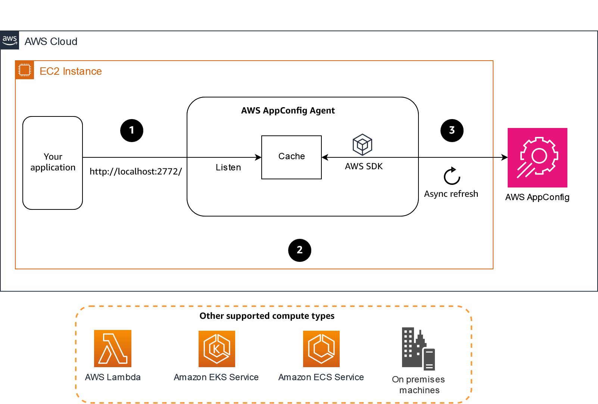

## Experiment to understand how AWS AppConfig works with application

[What is AWS AppConfig Agent?](https://docs.aws.amazon.com/appconfig/latest/userguide/appconfig-agent.html)


## Purpose
It verifies following 
  * How AWS AppConfig Agent works as sidecar
  * How performance degradation occurs when AppConfig Agent is requested every time
  * How `POLL_INTERVAL` affects lifecycle of application
  * How AWS AppConfig Agent credentials are set
by test code and play round by container

## Conclusion
  * Application requests configuration with REST simply
  * Service authorization can be done with AWS_PROFILE or other AWS credential method by providing credential to AppConfig Agent
    * It doesn't require modification or SDK for your application
  * AppConfig Agent works as local cache storage for AWS AppConfig service
    * It doesn't require caching result of credential from AppConfig service
    * It generally adds 1-5ms to acquire the configuration from the agent 
    * You should carefully set `POLL_INTERVAL` of AppConfig Agent because it affects deployment time
  * caution
    * Please use `EVENT NOTIFIER` if your application use some `POOL` such as database connection pool
      * You must have `PROPAGATION WAYS` inside of your application when AppConfig has deployed new version of configuration
      * PropertyUpdaterService, which uses these components to dynamically update properties
        * https://www.baeldung.com/spring-boot-properties-dynamic-update

## This repository includes 
  * Configuration spec of application
    * [poc_app:dev:main_json.json](aws_app_config/poc_app%3Adev%3Amain_json.json)
      ```json
      {
        "featureA": {
          "enabled": true
        },
        "featureB": {
          "enabled": false
        },
        "featureC": true,
        "Welcome": {
          "msg": "hello!"
        },
        "Maintenance": {
          "flag": false,
          "msg": "I'm sorry"
        }
      }
      ```
    
  * AWS App Config Agent by [container](./docker-compose.yml)
    * connected with AWS Account with exiting AppConfig
      * ```shell
        ## AWS Credential
        export AWS_REGION=ap-northeast-1
        # AWS Profile base with ~/.aws on host
        export AWS_PROFILE=XXX
        # AWS Access Key directly
        # export AWS_ACCESS_KEY_ID=XXX
        # export AWS_SECRET_ACCESS_KEY=XXX
        
        ## AWS AppConfig
        export AWS_APP_CONFIG_APPLICATION_ID=XXX
        export AWS_APP_CONFIG_ENVIRONMENT_ID=XXX
        export AWS_APP_CONFIG_CONFIGURATION_ID=XXX
        
        task up:aws
        ``` 
      * You may disable volume mount for aws credential `~/.aws`
    * local development server
      * ```shell
        task up:local
        ```
  * Web Application requests AppConfig Agent to retrieve stored configuration based on
    * WEB
      * at **requested time**
        * http://localhost:8080/welcome-instant
      * at **cached time by application**
        * http://localhost:8080/welcome-cached
    * REST
      * at **requested time**
        * ```shell
          $ curl http://localhost:8080/config-update-on-request-scope
          ```
        * It retrieves AppConfig Agent every request
        * AppConfig Agent log
        * ```log
          $ docker compose logs aws-app-config-agent
         
          aws-app-config-agent-1  | [appconfig agent] 2024/12/20 16:57:15 DEBUG verified latest data for '1x12yjo:dev:831rlwp' in 22.5ms
          aws-app-config-agent-1  | [appconfig agent] 2024/12/20 16:57:16 DEBUG returned local data for '1x12yjo:dev:831rlwp' in 458ns
          aws-app-config-agent-1  | [appconfig agent] 2024/12/20 16:57:19 DEBUG returned local data for '1x12yjo:dev:831rlwp' in 791ns
          ```
      * at **cached time by application**
        * ```shell
          $ curl http://localhost:8080/config-update-on-application-scope
          ```
        * It retrieves stored value of application
        * It polls AppConfig Agent every **5 seconds** since application has started
          * Poll interval from application to agent is set by [application.properties:4](src/main/resources/application.properties#L4)
            * property name: `aws_app_config.poll_time_to_agent`
        * AppConfig Agent log
        * ```log
          $ docker compose logs aws-app-config-agent
          ```